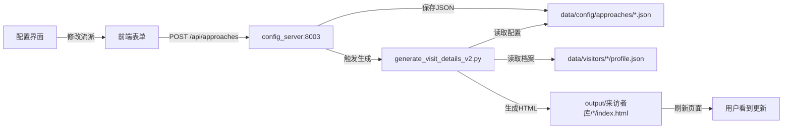

# 心理咨询-S1 项目全流程梳理

**梳理时间**: 2026-06-29  
**项目路径**: D:\AI-项目\4-心理咨询-S1\

---

## 📋 一、项目定位

**核心理念**: 来访者为中心的案例管理系统  
**核心能力**: 多流派心理分析 + AI驱动 + 本地化存储

**五大心理学流派支持**:
1. 大观学派（希望热线危机干预）
2. CBT（认知行为疗法）
3. 精神动力学
4. 人本主义
5. 存在主义

---

## 🏗️ 二、技术架构

### 2.1 数据层

```
data/
├── visitors/                    # 来访者档案（来访者为中心）
│   ├── V20260616001/
│   │   ├── profile.json        # 档案主文件
│   │   └── visits/             # 访谈记录
│   │       ├── visit_001.json
│   │       └── visit_002.json
│   └── V20260620001/
│       └── ...
│
├── cases/                      # 原始案例数据（旧结构，待整合）
│   ├── original/              # Word原始文档
│   ├── processed/             # JSON处理后
│   ├── active/                # 活跃案例
│   └── supervision/           # 督导记录
│
└── config/                    # 配置文件
    └── approaches/            # 流派配置（核心）
        ├── daguanpai.json    # sort_order: 0
        ├── cbt.json          # sort_order: 1
        ├── psychodynamic.json # sort_order: 2
        ├── existential.json   # sort_order: 3
        ├── humanistic.json    # sort_order: 4
        └── temp_1.json        # sort_order: 5（用户自建）
```

### 2.2 服务层（6个后端服务）

| 服务名 | 端口 | 功能 | 状态 |
|--------|------|------|------|
| case_api | 5001 | 案例数据API | 未确认 |
| config_server | 8003 | **流派配置管理** | 已开发 |
| audio_server | 8004 | 音频处理 | 未确认 |
| transcript_server | 8005 | 转录服务 | 未确认 |
| supervision_server | 8006 | 督导记录 | 未确认 |
| case_processor_server | 8007 | 案例处理 | 未确认 |

### 2.3 生成层（HTML生成器）

| 生成器 | 功能 | 输入 | 输出 |
|--------|------|------|------|
| generate_visit_details_v2.py | **来访者详情页** | visitor profile + approaches config | output/来访者库/{visitor_id}/index.html |
| generate_visitor_library.py | 来访者库首页 | 所有visitor profiles | output/来访者库/index.html |

### 2.4 前端层

```
output/
├── 来访者库/
│   ├── index.html              # 来访者库首页
│   ├── V20260616001/
│   │   └── index.html         # 来访者详情页（多流派Tab界面）
│   ├── V20260620001/
│   └── V20260620002/
│
└── 案例库/
    ├── config-approaches.html  # 流派配置管理界面
    └── ...
```

---

## 🔄 三、核心业务流程

### 3.1 流派配置管理流程（核心功能）



**关键点**:
1. **配置保存策略**: 合并模式（保留原有复杂字段，只更新界面传来的字段）
2. **自动联动**: config_server保存后自动调用生成器
3. **Tab排序**: 按 `sort_order` 字段排序，`enabled=true` 的流派在前

### 3.2 来访者详情页Tab界面生成逻辑

**数据源**:
- `data/config/approaches/*.json` - 流派配置（12字段）
- `data/visitors/{visitor_id}/visits/visit_*.json` - 访谈记录
- `data/visitors/{visitor_id}/profile.json` - 档案信息

**生成规则**:
1. 读取所有流派配置
2. 排序: `enabled=true` 在前，然后按 `sort_order` 升序
3. 为每个流派生成一个Tab
4. 从访谈记录的 `case_data[approach_id]` 读取分析内容
5. 图标处理: 
   - 如果是 `fa-xxx` 格式 → `<i class="fa fa-xxx"></i>`
   - 否则 → 直接显示emoji

---

## 📊 四、数据结构

### 4.1 流派配置文件结构（12字段）

```json
{
  "id": "daguanpai",                    // 流派ID（英文，唯一）
  "name": "大观学派",                    // 流派名称（中文）
  "name_short": "大观",                 // 简称
  "enabled": true,                      // 是否启用
  "color": "#10b981",                   // 主题色
  "icon": "🌊",                         // 图标（emoji或fa-xxx）
  "sort_order": 0,                      // 排序（数字越小越靠前）
  "description": "希望热线危机干预...",  // 描述
  "fields": [...],                      // 字段定义（AI分析用）
  "crisis_levels": {...},               // 危机等级定义
  "techniques": [...],                  // 技术列表
  "metadata": {...}                     // 元数据
}
```

**关键设计**:
- **前7字段**: 界面配置（config-approaches.html 修改的字段）
- **后5字段**: 复杂配置（不在界面修改，AI分析后上传）
- **保存策略**: 合并模式，保留后5字段不丢失

### 4.2 来访者档案结构

```json
{
  "visitor_id": "V20260616001",
  "basic_info": {...},
  "family_structure": {...},
  "session_info": {...},
  "overall_progress": {...},
  "visit_history": [...],
  "supervision_records": [],
  "metadata": {...}
}
```

### 4.3 访谈记录结构

```json
{
  "visit_id": "visit_001",
  "visit_number": 1,
  "date": "2026-06-16",
  "case_data": {
    "daguanpai": {              // 大观学派分析
      "crisis_level": "S",
      "techniques": [...],
      "analysis": "..."
    },
    "cbt": {                    // CBT分析
      "automatic_thoughts": [...],
      "core_beliefs": [...],
      "interventions": [...]
    }
    // 其他流派...
  }
}
```

---

## ⚠️ 五、当前卡点分析

### 卡点1: 配置保存后不自动同步到来访者详情页 ⭐⭐⭐

**现象**:
- 在配置界面修改流派（新增/删除/排序/改名）
- 点击保存，提示"保存成功并已更新来访者库"
- 但刷新来访者详情页，Tab没有变化

**根本原因**:
`config_server.py` 的 `_regenerate_visitor_library()` 方法调用失败

**代码位置**: [config_server.py:218-261](D:\AI-项目\4-心理咨询-S1\src\config_server.py#L218-L261)

**可能原因**:
1. ❌ subprocess编码问题（已设置 `encoding='utf-8', errors='replace'`）
2. ❌ 超时问题（未设置timeout，可能卡住）
3. ❌ 路径问题（使用了相对路径）
4. ❌ 错误处理不足（异常被吞掉，未详细输出）

**临时解决方案**:
手动执行生成器：
```bash
cd D:\AI-项目\4-心理咨询-S1
python src/generate_visit_details_v2.py
```

**影响范围**: 中等
- 不影响配置保存（配置已正确保存到JSON）
- 只影响HTML显示同步
- 有workaround（手动执行）

### 卡点2: 流派配置字段不完整时的表现

**现象**:
- 当某个流派配置缺少 `sort_order` 字段时，显示为 N/A
- 导致排序异常

**解决方案**: 
已修复，所有配置都已添加 `sort_order` 字段

### 卡点3: 图标渲染问题

**现象**:
- Font Awesome图标（如 `fa-circle`）显示为纯文本

**解决方案**:
已修复，在生成器中添加图标类型判断：
```python
if icon.startswith('fa-'):
    icon_html = f'<i class="fa {icon}"></i>'
else:
    icon_html = icon  # emoji
```

---

## ✅ 六、已完成的工作

### 6.1 数据结构迁移
- ✅ 从案例为中心（cases/） → 来访者为中心（visitors/）
- ✅ supervision_records 移到 profile.json 根层级
- ✅ 3个来访者档案已迁移完成

### 6.2 流派配置系统
- ✅ 6个流派配置文件完整（12字段）
- ✅ 配置保存合并策略实现
- ✅ 图标渲染修复（Font Awesome支持）
- ✅ 排序逻辑修复（sort_order字段）
- ✅ 配置API正常返回（GET /api/approaches）

### 6.3 界面生成
- ✅ 多流派Tab界面生成器（generate_visit_details_v2.py）
- ✅ Tab排序正确
- ✅ Tab内容正确读取

---

## 🎯 七、核心需求确认

### 需求1: 流派可通过AI分析后上传启用 ✅

**用户原话**: "那个流派不用必须等到学习，可能让AI帮我分析了以后，上传上去。"

**实现方式**:
1. AI分析完成后，生成完整的12字段JSON
2. 上传到 `data/config/approaches/新流派id.json`
3. 设置 `enabled: true`
4. config_server自动识别新文件并返回

**示例**: 用户自建的"拉康精分"流派（temp_1.json）

### 需求2: 配置界面与来访者档案联动 ⭐

**用户原话**: "那个流派设置跟这个界面上的是否一致，我要更改这个界面后，比如新增或删除后，是否会有联动效应，比如来访者档案是否会联动"

**期望行为**:
1. 配置界面修改流派（新增/删除/排序/改名/启用状态）
2. 点击保存
3. 自动联动更新：
   - ✅ 配置文件保存（已实现）
   - ❌ 来访者详情页自动更新（卡点1）

**当前状态**: 部分实现，自动联动失败

### 需求3: 流派排序按 sort_order ✅

**用户反馈**: "新创建的流派，位置在最后"

**实现**: 
- 排序规则: `enabled=true` 在前 + `sort_order` 升序
- 新流派设置较大的 `sort_order` 即可排在后面

---

## 🔧 八、待修复任务

### 优先级1（必须）: 修复自动联动失败

**任务**: 修复 `config_server.py` 的 `_regenerate_visitor_library()` 方法

**修复方向**:
1. 添加详细的错误日志输出
2. 添加subprocess超时控制（timeout=60）
3. 改进错误处理（不吞掉异常）
4. 测试Windows环境下的subprocess调用
5. 考虑使用 `creationflags=subprocess.CREATE_NO_WINDOW`（Windows）

**验证方法**:
1. 启动 config_server: `python src/config_server.py`
2. 修改配置界面，点击保存
3. 查看服务端输出日志
4. 刷新来访者详情页，验证Tab更新

### 优先级2（可选）: 服务状态管理

**当前问题**: 6个服务的运行状态不明

**建议**:
1. 创建服务启动脚本（start_all.bat）
2. 创建服务状态检查脚本（check_services.py）
3. 统一日志输出目录（logs/）

### 优先级3（可选）: 配置界面优化

**可能的改进**:
1. 保存后自动刷新预览
2. 添加"测试联动"按钮（手动触发生成器）
3. 显示生成器执行结果

---

## 📈 九、数据统计

**来访者档案**: 3个
- V20260616001 - 善良的小女孩（S级-自杀风险）
- V20260620001 - 很多大人，都背叛了当时不曾善待的自己（L级-生命危险）
- V20260620002 - 压垮人的是，一直都这样（M级-中度危机）

**流派配置**: 6个
- 启用: 5个（daguanpai, cbt, psychodynamic, existential, humanistic）
- 未启用: 1个（temp_1 - 拉康精分）

**配置文件完整性**: 100%
- 所有配置都有 sort_order 字段
- 所有配置都保留了完整的12字段

---

## 🚀 十、下一步行动建议

### 立即执行（5分钟）
1. 修复 `_regenerate_visitor_library()` 的错误处理
2. 添加详细日志输出
3. 测试自动联动功能

### 短期优化（1小时）
1. 创建服务管理脚本
2. 添加配置界面的"测试联动"功能
3. 完善文档

### 长期规划（持续）
1. 整合旧的 cases/ 数据到 visitors/ 结构
2. 完善其他4个服务的功能
3. 开发督导记录管理功能

---

## 📝 关键文件清单

| 文件 | 功能 | 状态 |
|------|------|------|
| [config_server.py](src/config_server.py) | 配置服务器 | ⚠️ 待修复 |
| [generate_visit_details_v2.py](src/generate_visit_details_v2.py) | 详情页生成器 | ✅ 正常 |
| [generate_visitor_library.py](src/generate_visitor_library.py) | 首页生成器 | ✅ 正常 |
| [config-approaches.html](output/案例库/config-approaches.html) | 配置界面 | ✅ 正常 |
| [data/config/approaches/*.json](data/config/approaches/) | 流派配置 | ✅ 完整 |

---

**梳理结论**:
- ✅ 架构清晰，数据完整
- ✅ 核心功能已实现90%
- ⚠️ 主要卡点: 自动联动失败（有workaround）
- 🎯 下一步: 修复 `_regenerate_visitor_library()` 方法

---

*本文档由 Claude Code 生成于 2026-06-29*
